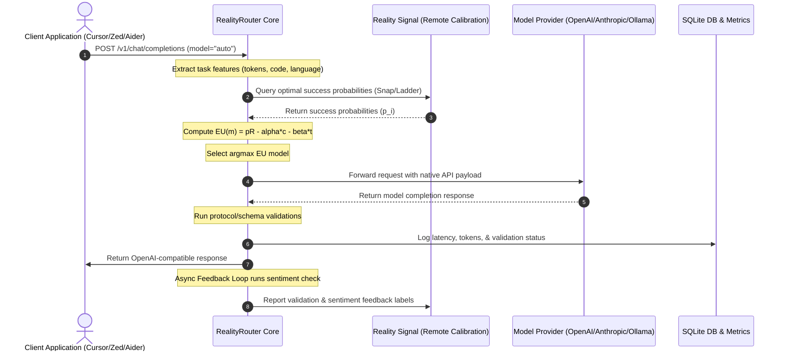

# For AI Agents: RealityRouter Developer & Integration Guide

Welcome! This guide is written explicitly for AI agents, developer tools, and automation scripts working with or within the RealityRouter codebase. It defines the core architecture, testing guidelines, coding standards, and integration patterns.

---

## 1. Core Architecture

RealityRouter is an agent-native, utility-optimized LLM routing layer. It intercepts LLM requests, evaluates cost vs. time vs. accuracy constraints, and dynamically dispatches requests to the most optimal provider or local model.



### Key Modules:
- **`start_router.py`**: The main entry point CLI. Handles interactive configuration wizards, headless setups, diagnostics (`doctor`), and daemon control (`start`, `status`, `stop`).
- **`src/router/core.py`**: The routing brain. Implements expected utility theory calculations (`ExpectedUtilityCalculator`) and coordinates Snap and Ladder execution flows.
- **`src/adapters/`**: Translate standard OpenAI/LiteLLM request and response payloads to different providers (e.g., LiteLLM, local models).
- **`src/utils/pricing.py`**: Discovers and caches pricing metadata from providers.

---

## 2. Testing Guidelines

RealityRouter has an isolated test integration harness to prevent modifications from leaking or touching live developer environments.

### Running Tests:
Always use the isolated integration test harness:
```bash
python3 reality-router/tests/run_isolated_tests.py
```
This script scaffolds a clean sandboxed workspace at `reality-router/dist_test`, sets up a mock `.env` config, and executes `pytest` over all scenarios.

### Writing New Tests:
- Place scenario integration tests under `reality-router/tests/test_isolated_scenarios.py` or `test_cli.py`.
- Ensure tests do **not** assume any active credentials or modify the local `~/.reality_router/.env` file.
- Use `pytest` fixtures and mock active network requests (e.g., `httpx.AsyncClient.post`, `urllib.request.urlopen`).

---

## 3. Coding Standards

- **Strict Type Safety & Validation**: Utilize Pydantic models (from `src/models/routing.py`) for all incoming and outgoing API schemas.
- **Idempotency**: All installation scripts (`install.sh`, `install.ps1`) and setup tasks must be 100% idempotent. If a configuration or directory already exists, update/upgrade it gracefully without losing user credentials or SSO tokens.
- **Precedence Rule**: Always resolve configuration fields using the strict precedence chain:
  `CLI Flags > Environment Variables > Config File (.env) > Auto-detect > Fallbacks > Prompts (Interactive-only)`
- **Secrets Management**: Never log, print, or output API keys, passwords, or SSO tokens in stdout or logs. Under `--json`, display status indicators or placeholder hashes only.

---

## 4. Agent Discoverability & Machine-Readability

For AI agents controlling the shell:
- **Zero-Prompts**: Use `--agent` to choose sensible defaults and auto-detect settings, bypassing any TUI prompt loops.
- **Hanging Protection**: The CLI automatically errors out and exits if run without a TTY (`sys.stdin.isatty() == False`) unless `--agent` or `--non-interactive` are specified.
- **JSON Event Streams**: The `auth` command outputs newline-delimited JSON (NDJSON) events (e.g., `auth_required` with `verification_uri` and `user_code`) so you can programmatically read authentication details, execute OAuth verification, and track progress.
