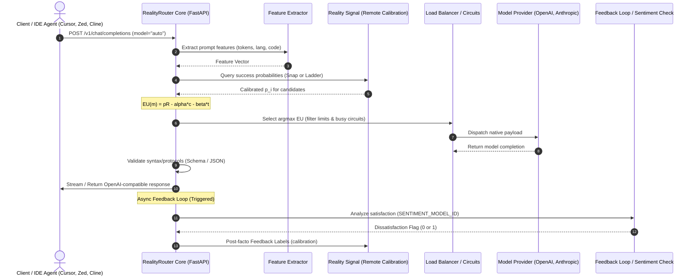

# RealityRouter System Architecture (`ARCHITECTURE.md`)

This document describes the current production architecture, components, request life-cycle, and data boundaries of RealityRouter.

---

## 1. System Purpose
RealityRouter is an agent-native, utility-optimized LLM routing layer. It intercepts client OpenAI-compatible LLM requests, extracts prompt-level task features, evaluates costs/latencies against statistical success calibrations, and dispatches requests to the most optimal model (cloud or local) using Expected Utility Theory.

---

## 2. Request Sequence Diagram



---

## 3. Directory & Module Map

All active source code is contained within the `reality-router/` directory:

```
reality-router/
├── src/
│   ├── main.py                 # FastAPI Application Server Entrypoint
│   ├── config/
│   │   └── settings.py         # Strict Precedence Settings Manager (.env loader)
│   ├── models/
│   │   ├── database.py         # SQLite / SQLAlchemy Database Engine
│   │   └── routing.py          # Pydantic Schemas for Requests & Protocols
│   ├── router/
│   │   ├── core.py             # ExpectedUtilityCalculator & Core Routing Coordinator
│   │   ├── load_balancer.py    # Concurrency Semaphore & Thread Limit Registry
│   │   └── metrics.py          # Dashboard statistics & latency accumulator
│   └── utils/
│       ├── feature_extractor.py # Regex/AST keyword parser & structural analyzer
│       ├── pricing.py          # Provider price discovery & pricing overrides
│       ├── model_info.py       # Default registry for model definitions
│       └── logger.py           # User-only logs & secrets redaction filter
├── tests/                      # Isolated Integration Test Harness
└── event_viewer.py             # Real-time CLI decision monitoring console
```

---

## 4. Trust & Security Boundaries

RealityRouter runs entirely inside your local network workspace.
1. **Model Credentials**: API keys (`OPENAI_API_KEY`, etc.) remain in local memory/file storage (`~/.reality_router/.env`). They are passed directly to downstream model providers. They are **never** shared with Reality Signal.
2. **Raw Prompts**: Raw prompts and generated completions **never** transit through RealityRouter hosted servers. They go directly from your local instance to the model provider.
3. **Local State**: Historic metrics, local success logs, and settings are saved under user-only restricted permissions inside `~/.reality_router/router.db`.

---

## 5. Startup & Configuration Flow

During start, the following sequence resolves configuration (subsystem `config/settings.py`):
1. **Precedence**: Command Line Flags override Process Environment Variables, which override `.env` parameters, which override auto-detection (e.g. Ollama tags), which fallback to interactive prompts.
2. **Model Discovery**: RealityRouter queries active providers dynamically (e.g. Google Generative Language APIs, Ollama `/api/tags`, etc.) to build the active pool.
3. **State Persist**: The selected TCP port is written to `~/.reality_router/router.port` and the active process id to `~/.reality_router/router.pid`.

---

## 6. Request Lifecycle & Routing Engine

### Step 1: Feature Extraction
When a client sends a request to `/v1/chat/completions`:
- The request is tokenized (using tiktoken/char heuristics).
- `src/utils/feature_extractor.py` scans for structural patterns: coding block counts, JSON schemas, natural language indicators, and active tool counts.

### Step 2: Calibration Request
The extracted feature vector is sent anonymously to Reality Signal:
- **Snap Strategy**: Returns the long-run probability of success `p_i` for each candidate model in your pool.
- **Ladder Strategy**: Runs a sequential calibration curve to find the lowest-tier model likely to satisfy the query.

### Step 3: Expected Utility Calculation
Core uses `ExpectedUtilityCalculator` to find:
```text
EU = (p_i · R) - (α · cost · 1000.0) - (β · latency) - penalty_pref
```
- Cost is scaled by `1000.0` to bring fractional dollars to a millidollar magnitude equivalent to latency in seconds.
- Multipliers `α` and `β` weight your respective preferences.

### Step 4: Dispatch & Load Balancing
The selected model is sent to the `LoadBalancer`:
- Checks if the selected model has exceeded its configured `thread_limit` concurrency semaphore.
- Dispatches via the provider-specific adapter.

### Step 5: Post-Response Validation
Once a completion is returned:
- Core validates JSON structures, closed Markdown tags, and looks for protocol leaks (like unscrubbed agent markers).
- If validation fails under **Ladder**, the request is immediately escalated to the next best flagship model.

### Step 6: Async Feedback Loop
Once the final valid answer is returned to the user, the request transaction completes. In the background:
- The Sentiment Loop runs a classification check on follow-up messages using the cheap `SENTIMENT_MODEL_ID` to detect user dissatisfaction.
- Out-of-band feedback labels (`validation_success`, `sentiment_rejected`) are logged to the local database and reported to Reality Signal to calibrate future probability curves.
