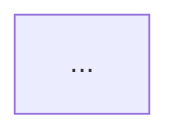

# RealityRouter Documentation Review — Updated Developer Instructions

**Repository:** https://github.com/Lars-confi/RealityRouter  
**Branch reviewed:** `main`  
**Review date:** 2026-09-16  
**Purpose:** Replace the previous documentation task list after the recent agent/headless/integration updates.

---

## Executive summary

The documentation has improved substantially since the previous review.

In particular, **do not redo** the work that has already been added around agent-native use:

- `AGENTS.md` now exists.
- `llms.txt` now exists.
- `docs/agent-install.md` now exists.
- `docs/integrations.md` now exists.
- Agent-oriented CLI commands now exist for setup, authentication, status, diagnostics, model management, and detached startup.
- `doctor --json` has machine-readable diagnostics and documented exit codes.
- The installer now creates a real `~/.local/bin/reality-router` wrapper.
- The README and FAQ explain the intended audience much better than before.
- Provider coverage in the public documentation has been broadened.

The main documentation problem is now **consistency and precision**, not absence of introductory material.

The highest-value work is to make the README, quickstart, API reference, agent docs, architecture docs, privacy/security statements, and actual CLI/API behavior tell the **same story**.

This document therefore focuses on what is **still missing or inconsistent today**.

---

# P0 — Correctness, security, and trust

These items should be completed before adding more integrations or marketing material.

---

## 1. Make the CLI documentation internally consistent

### Files

- `README.md`
- `llms.txt`
- `AGENTS.md`
- `docs/quickstart.md`
- `docs/agent-install.md`
- `start_router.py` if documentation exposes a real implementation mismatch

### Current state

The new CLI structure is good and should become the canonical interface:

```bash
reality-router setup --agent
reality-router setup --non-interactive
reality-router auth --agent --json
reality-router start --agent --detach
reality-router status --json
reality-router doctor --json
reality-router models --disable-model <id> --json
```

However, `docs/agent-install.md` still uses the older legacy style:

```bash
reality-router --headless --set DEEPSEEK_API_KEY=...
reality-router --headless --detach
reality-router --headless --status
```

The old flags may remain for backward compatibility, but new documentation should use one canonical syntax.

### Required change

1. Use the command-oriented CLI everywhere in user-facing documentation.
2. Move legacy syntax to a small **Legacy compatibility** note if it must remain supported.
3. Add `docs/cli.md` as the authoritative CLI reference.
4. Generate or manually maintain the reference from `reality-router --help`.

The CLI reference should cover:

- `setup`
- `start`
- `status`
- `doctor`
- `models`
- `auth`
- `--agent`
- `--non-interactive`
- `--json`
- `--port`
- `--detach`
- `--set`
- routing strategy flags
- cost/time sensitivity flags
- sentiment model selection
- model enable/disable
- custom Snap/Ladder URLs

### Specific inconsistency to fix

`AGENTS.md` currently describes daemon control as including `stop`, but the current CLI parser exposes:

```text
setup, start, status, doctor, models, auth
```

Either:

- implement and document `reality-router stop`; or
- remove `stop` from `AGENTS.md`.

Do not document a command that does not exist.

---

## 2. Fix port discovery/status before telling agents to rely on it

### Files

- `start_router.py`
- `docs/agent-install.md`
- `docs/integrations.md`
- `docs/quickstart.md`
- `llms.txt`

### Current state

The router can choose the next free port when no explicit `--port` is given.

`docs/agent-install.md` correctly tells agents not to assume port 8000.

However, the current `status` implementation appears to default to port 8000 unless a port is explicitly supplied, while detached startup can select another port.

That means documentation may tell an agent to ask `status --json` for the actual port even though the selected runtime port may not be persisted robustly enough for a later status command.

### Required change

Persist the selected port as daemon state, for example:

```text
~/.reality_router/router.json
```

or:

```text
~/.reality_router/router.port
```

Then make:

```bash
reality-router status --json
```

return the real running port.

Suggested JSON contract:

```json
{
  "status": "running",
  "pid": 12345,
  "port": 8001,
  "url": "http://localhost:8001",
  "base_url": "http://localhost:8001/v1",
  "dashboard_url": "http://localhost:8001/metrics/dashboard"
}
```

### Documentation rule

After this change, integrations should say:

> Run `reality-router status --json` and use `base_url`. The examples below use port 8000 only for readability.

Do not teach autonomous agents to hard-code 8000.

---

## 3. Fix the Quickstart OpenAI example

### Files

- `docs/quickstart.md`
- `README.md` if an example is added there
- `docs/api.md`

### Current state

The quickstart still uses the old pre-1.x Python OpenAI style:

```python
import openai
openai.api_base = "http://localhost:8000/v1"
openai.api_key = "any"
openai.ChatCompletion.create(...)
```

This should be replaced with a current tested OpenAI client example.

### Required change

Test and document something in this form:

```python
from openai import OpenAI

client = OpenAI(
    base_url="http://localhost:8000/v1",
    api_key="rr-local",
)

response = client.chat.completions.create(
    model="auto",
    messages=[
        {
            "role": "user",
            "content": "Write a high-performance Rust function to parse JSON."
        }
    ],
)

print(response.choices[0].message.content)
```

Also include a `curl` request because it is the easiest protocol-level smoke test.

### Acceptance criterion

The exact quickstart example must be exercised against the current server in CI or a smoke test.

---

## 4. Remove the absolute “100% OpenAI API compatible” claim

### Files

- `README.md`
- `docs/quickstart.md`
- `docs/api.md`
- `docs/integrations.md`

### Current state

The README and quickstart still say:

> RealityRouter is 100% OpenAI API compatible.

The API reference currently documents a much smaller explicit surface.

Absolute compatibility means far more than accepting `POST /v1/chat/completions`.

### Required wording

Prefer:

> RealityRouter exposes an OpenAI-compatible API for the endpoints and features documented below.

Then create a tested compatibility matrix in `docs/api.md`.

Suggested table:

| Capability | Status | Notes |
|---|---|---|
| `POST /v1/chat/completions` | Tested / Partial / No | |
| `POST /v1/completions` | | |
| `GET /v1/models` | | |
| Streaming/SSE | | |
| `tools` | | |
| `tool_choice` | | |
| JSON/structured output | | |
| image input | | |
| audio input | | |
| OpenAI Responses API | | |
| reasoning parameters | | |
| logprobs | | |
| embeddings | | |
| provider-specific extensions | | |

Do not mark anything supported based only on the intended design. Test it.

---

## 5. Resolve the `/responses` integration inconsistency

### Files

- `docs/integrations.md`
- `docs/api.md`
- API implementation/tests if applicable

### Current state

The Codex CLI integration currently says:

> set `wire_api = "responses"` only if pointing at RR's `/responses` endpoint.

But `docs/api.md` does not document a Responses API endpoint.

### Required change

Choose one:

### If Responses API is implemented

Document:

- exact endpoint, preferably `/v1/responses`;
- supported request fields;
- streaming behavior;
- tool behavior;
- response mapping;
- known unsupported fields;
- Codex configuration.

Add a smoke test.

### If Responses API is not implemented

Remove the `/responses` statement from the integration guide and document the supported Codex wire mode only.

---

## 6. Add a real privacy/data-flow document and fix contradictory privacy statements

### New file

`docs/privacy.md`

### Files to correct

- `docs/dashboard.md`
- `docs/faq.md`
- `docs/concepts.md`
- `docs/agent-install.md`
- `README.md` where appropriate

### Current contradiction

`docs/dashboard.md` currently ends its local-state section with:

> Nothing leaves this directory.

That cannot be a correct description of the whole system: cloud provider requests leave the machine, and `docs/concepts.md` explicitly says prompt-derived features are sent to the Reality Router calibration service.

`docs/faq.md` also says:

> no traffic through anyone else's infrastructure

and:

> Do my prompts go through your servers? No.

That may be intended to mean that **raw model requests are not proxied through a hosted RealityRouter gateway**, but that distinction is not currently explained.

### Required change

Create an explicit data-flow table based on the implementation.

Example structure:

| Data | Stored locally? | Sent to model provider? | Sent to Reality Signal? | Notes |
|---|---:|---:|---:|---|
| Raw user prompt | | | | |
| System prompt | | | | |
| Tool schema | | | | |
| Tool calls | | | | |
| Extracted task features | | | | |
| Agent fingerprint | | | | |
| Selected model | | | | |
| Validation outcome | | | | |
| Sentiment result | | | | |
| User email | | | | |
| User location | | | | |
| Provider API keys | | | | |
| Reality Signal token | | | | |
| Cost/latency metrics | | | | |

The developer must fill this from code, not from assumptions.

### Replace the dashboard sentence

Use something precise, e.g.:

> Persistent local state is stored under `~/.reality_router/`. RealityRouter also makes network requests to configured model providers and, when enabled, Reality Signal. See `docs/privacy.md` for the exact data flow.

### Rewrite the FAQ privacy answer

It should distinguish:

1. whether raw prompts pass through RealityRouter-operated servers;
2. what goes directly to the selected model provider;
3. what derived metadata/features go to Reality Signal;
4. whether Reality Signal can be disabled and what functionality changes.

This is one of the most important trust questions in the project.

---

## 7. Add `SECURITY.md` and clearly document ingress security

### New file

`SECURITY.md`

### Files to update

- `README.md`
- `docs/api.md`
- Docker/deployment docs

### Current state

`docs/api.md` states that a client must send an `Authorization` header but that its value is **not validated**.

At the same time, the Dockerfile starts Uvicorn with:

```text
--host 0.0.0.0
```

That combination requires an explicit warning.

### Required warning

Until real ingress authentication exists:

> Do not expose the RealityRouter HTTP port directly to an untrusted network. Keep it on localhost/private networking or place it behind an authenticated reverse proxy/VPN.

### `SECURITY.md` should cover

- supported versions;
- responsible vulnerability reporting;
- ingress authentication status;
- dashboard authentication status;
- safe localhost use;
- remote/private-network deployment;
- reverse proxy/TLS;
- secrets storage;
- expected permissions on `~/.reality_router/.env`;
- log redaction;
- provider API-key handling;
- Reality Signal token handling;
- Docker considerations;
- multi-user host considerations.

### Also fix the README wording

The README currently says:

> API Key — `any` (or your configured secret)

The API reference says the value is not validated.

Until an ingress secret actually exists, remove “or your configured secret.”

---

## 8. Fix TLS verification in provider discovery rather than documenting insecure behavior

### File

`start_router.py`

### Documentation affected

- `SECURITY.md`
- `docs/configuration.md`
- provider docs

### Current state found during review

The current discovery code creates SSL contexts with certificate verification disabled for some discovery paths.

This should not become the documented default.

### Required change

Use normal TLS verification by default.

If self-signed/custom enterprise endpoints need support, expose an explicit opt-in, preferably through:

- a custom CA bundle; and/or
- an intentionally named insecure flag such as `INSECURE_SKIP_TLS_VERIFY=true`.

If an insecure override exists, give it a strong warning in security/configuration docs.

---

## 9. Reconcile the advertised provider list with the actual configuration/discovery code

### Files

- `README.md`
- `docs/quickstart.md`
- `docs/providers.md` — new
- `start_router.py`
- provider adapters/tests

### Current state

The public documentation now advertises:

- OpenAI
- Anthropic
- Gemini
- Mistral
- DeepSeek
- Moonshot / Kimi
- Z.ai / GLM
- xAI / Grok
- Alibaba Qwen
- Ollama
- generic OpenAI-compatible endpoints

That is a good expansion, but the current `start_router.py` provider metadata visible in `PROVIDER_KEYS` still centers on:

- OpenAI
- Anthropic
- Mistral
- DeepSeek
- Hugging Face
- Gemini
- custom/local

The quickstart also says the **wizard** accepts Kimi, Z.ai, xAI and Alibaba Qwen keys.

### Required change

Verify every advertised provider end-to-end.

Create `docs/providers.md`:

| Provider | Credential variable | Auto-discovery | Chat | Streaming | Tools | Vision | Tested |
|---|---|---:|---:|---:|---:|---:|---:|
| OpenAI | | | | | | | |
| Anthropic | | | | | | | |
| Gemini | | | | | | | |
| Mistral | | | | | | | |
| DeepSeek | | | | | | | |
| Moonshot/Kimi | | | | | | | |
| Z.ai/GLM | | | | | | | |
| xAI/Grok | | | | | | | |
| Alibaba Qwen | | | | | | | |
| Hugging Face | | | | | | | |
| Ollama | | | | | | | |
| Generic OpenAI-compatible | | | | | | | |

For any provider that is not actually first-class:

- either implement it; or
- document it as generic OpenAI-compatible rather than first-class.

The wizard, `setup --agent`, `doctor`, status output, README and provider docs should all derive from the same provider registry if possible.

---

## 10. Rewrite `ARCHITECTURE.md` from the current implementation

### File

`ARCHITECTURE.md`

This remains one of the largest stale-documentation problems.

### Current issues

It still contains:

- old dependency versions;
- generic components such as “Load Balancer” and “Configuration Manager” without mapping them clearly to current modules;
- old/partial endpoint lists;
- speculative design prose;
- phrases such as “Perhaps we need…”;
- implementation ideas written in future tense.

An architecture document must describe the **current system**, not mix current behavior with design brainstorming.

### Required structure

Rewrite it approximately as:

1. System purpose
2. Trust boundaries
3. Directory/module map
4. Startup/configuration flow
5. Request lifecycle
6. Feature extraction
7. Reality Signal request/response
8. Snap decision path
9. Ladder decision path
10. Provider adapter layer
11. Tool/protocol validation
12. Feedback loop
13. State/database
14. Metrics/dashboard
15. Agent/session identification
16. Failure/circuit-breaker behavior
17. Deployment model
18. Security boundaries

Add a Mermaid request sequence diagram.

Move non-implemented ideas to:

```text
docs/design/
```

or GitHub Issues/Roadmap.

Do not leave speculative prose in the authoritative architecture document.

---

## 11. Add the license that the FAQ claims exists

### New file

`LICENSE`

### Current inconsistency

`docs/faq.md` says:

> It is MIT-licensed

but the repository root currently has no `LICENSE` file.

### Required change

If MIT is the intended license, add the canonical MIT license with the correct copyright holder/year and add a License section to the README.

If MIT is **not** the intended license, correct the FAQ immediately.

Until a license file exists, do not describe the repository as MIT-licensed.

---

# P1 — Documentation completeness for developers and operators

---

## 12. Add a complete configuration reference

### New files

- `docs/configuration.md`
- `.env.example`

The new agent CLI reduces the need to hand-edit `.env`, but it makes a proper configuration reference even more important.

For each setting document:

- key/environment variable;
- purpose;
- type;
- default;
- allowed values/range;
- secret or non-secret;
- whether persisted;
- whether restart is required;
- which subsystem consumes it.

At minimum include current settings around:

- `REALITY_ROUTER_HOME`
- all provider keys/base URLs
- `REALITY_CHECK_TOKEN`
- Reality Signal Snap URL
- Reality Signal Ladder URL
- routing strategy
- cost sensitivity
- time sensitivity
- sentiment model
- disabled models
- user email/location if still used
- server port/bind address
- retry/timeout settings
- circuit breaker
- concurrency/thread limits
- logging
- model/pricing overrides
- TLS/custom CA behavior after the security fix

Document precedence exactly.

The code comments currently describe the desired hierarchy approximately as:

```text
CLI > process environment > .env > auto-detect > defaults/prompts
```

Verify the implementation and make one source authoritative.

---

## 13. Expand integrations and add a tested-support matrix

### File

`docs/integrations.md`

### Current progress

The new integration page is a good addition and currently provides detailed setup for:

- OpenCode
- Cursor
- Aider
- Cline
- Codex CLI

Keep this.

### Still missing

The README advertises or discusses clients such as:

- Claude Code
- Zed
- Roo Code
- OpenClaw
- AutoGPT

`docs/agent-install.md` also says several other tools are fully automatable.

Either provide exact instructions or clearly label them as not yet tested/documented.

### Add a matrix at the top

| Client | Tested version | Protocol | Tools | Streaming | Auto-configurable | Guide |
|---|---|---|---:|---:|---:|---|
| OpenCode | | OpenAI-compatible | | | Yes | |
| Cursor | | | | | No/GUI | |
| Aider | | | | | Yes | |
| Cline | | | | | No/GUI | |
| Codex CLI | | | | | Yes | |
| Claude Code | | | | | | |
| Zed | | | | | | |
| Roo Code | | | | | | |
| OpenClaw | | | | | | |

### Claude Code should be the next dedicated integration

The README names Claude Code prominently, so add exact current instructions covering:

- what endpoint/protocol Claude Code uses;
- whether Anthropic-style `/v1/messages` is supported;
- whether an OpenAI-compatible workaround is required;
- required environment/config settings;
- whether Claude subscription/OAuth can be used;
- whether a separate Anthropic API key is required;
- tool calls;
- reasoning/thinking fields;
- streaming;
- how to verify routing in the dashboard.

Do not imply Claude Code support merely because RealityRouter can route to Anthropic models.

---

## 14. Stop hard-coding example model IDs in integration guides unless they are intentionally illustrative

### File

`docs/integrations.md`

The integration examples currently contain specific model IDs such as:

```text
claude-opus-5
gpt-5
claude-haiku-4-5
```

These become stale quickly and may not exist in every user's provider pool.

Prefer:

```text
auto
```

for the primary examples.

If showing pinned models, retrieve them from:

```bash
reality-router models --json
```

or the equivalent actual model-list endpoint/command.

Explain that model availability depends on the user's configured providers.

---

## 15. Clarify `model="auto"` versus model pinning

### Files

- `README.md`
- `docs/api.md`
- `docs/routing.md`

The API reference says a concrete model pins the request.

The README currently says:

> Model — `auto` (or any model name; the router intercepts and chooses the best actual model for the job)

Those statements can be read as contradictory.

Document exact semantics:

- `auto` → RealityRouter chooses;
- concrete model ID → does it bypass initial routing?
- does validation/escalation still occur after pinning?
- `tier:cheap` → exact behavior;
- `tier:flagship` → exact behavior;
- what happens if a pinned model is unavailable/disabled?
- can provider be pinned?
- can request-level routing coefficients be overridden?

Add tests for the documented contract.

---

## 16. Consolidate dynamic-port guidance in integrations

### Files

- `docs/integrations.md`
- `docs/agent-install.md`
- `docs/quickstart.md`

`docs/integrations.md` currently says all snippets assume port 8000.

That is okay for human-readable examples, but agents should discover the actual endpoint.

After the status fix in P0, add:

```bash
reality-router status --json
```

and tell users/agents to use `base_url`.

For GUI instructions, say:

> If your router is not on 8000, obtain the current Base URL with `reality-router status`.

---

## 17. Fix the “no human intervention” wording

### File

`docs/quickstart.md`

It currently says an AI agent can complete setup:

> without any human intervention

But `docs/agent-install.md` correctly says the agent must ask the user for provider keys, and OAuth/device-code authentication may also require user action.

Replace with something like:

> without interactive setup prompts; user action may still be required to supply credentials or complete authentication.

This is more accurate and still communicates the benefit.

---

## 18. Tighten Snap/Ladder terminology and routing explanations

### Files

- `README.md`
- `docs/quickstart.md`
- `docs/routing.md`
- `docs/concepts.md`
- CLI help/dashboard

Use one mapping consistently:

| Public name | Description | Internal identifier |
|---|---|---|
| **Snap** | single-shot expected-utility routing | `expected_utility` |
| **Ladder** | sequential assessment/escalation | `tiered_assessment` |

### Fix the Snap call-count wording

`docs/routing.md` says:

> exactly one LLM call per request

and immediately says a validation failure can cause escalation.

Use:

> Normal path: one LLM call. A validation failure can trigger fallback attempts.

### Clarify “evaluates every model in parallel”

Make clear that Snap computes/evaluates model utilities without calling every candidate LLM in parallel.

### Explain Ladder's `p_next = 1.0`

The current routing doc says the fallback calculation assumes:

```text
p_next = 1.0
```

If that is genuinely the implementation:

- explain that it is an optimistic upper-bound approximation;
- explain why it is used;
- explain how it affects stopping;
- consider whether a calibrated `p_next` would be more consistent with the rest of the system.

If it is stale documentation, remove it.

---

## 19. Explain the units/scaling of expected utility

### Files

- `docs/concepts.md`
- `docs/routing.md`
- dashboard docs

The formula is clear:

```text
EU(m) = pR - αc - βt
```

but a user still cannot reconstruct a score reliably.

Document:

- exact unit of `c`;
- exact unit of `t`;
- value and unit interpretation of `R`;
- internal range of α;
- internal range of β;
- mapping from dashboard slider values to α/β;
- whether any normalization occurs;
- whether β is independent of α;
- whether different cost/latency scales can dominate the score.

Add one complete numerical example comparing 2–3 models.

A user should be able to reproduce the selected model with a calculator.

---

## 20. Tighten statistical validity/calibration wording

### File

`docs/concepts.md`

The current page has useful material but makes very strong claims, including statements equivalent to:

- 70% predictions occur 70% of the time;
- distribution-free guarantees;
- `p_i` being “the most honest estimate you can get”;
- guarantees applying to published outputs.

This needs a more precise separation between mathematical theory and the exact Reality Signal implementation.

### Add sections for

1. **Target outcome** — what exactly counts as success?
2. **Calibration population** — which requests/outcomes enter calibration?
3. **Assumptions** — especially exchangeability.
4. **What Venn validity guarantees actually say.**
5. **What conformal coverage guarantees actually say.**
6. **What is empirically measured rather than guaranteed.**
7. **Distribution shift / non-exchangeability.**
8. **Cold-start models/tasks.**
9. **Relationship between Venn outputs and the scalar `p_i` used by Expected Utility.**
10. **How the dashboard calibration curve is computed.**

Remove evaluative language such as:

> the most honest estimate you can get

unless it is explicitly framed as product positioning rather than a mathematical theorem.

---

## 21. Document what “success” and feedback mean

### New file or section

`docs/feedback.md`

RealityRouter currently discusses:

- validation success;
- quality failure;
- sentiment;
- successful completion;
- calibration feedback;
- infrastructure failure.

These are not the same thing.

Document separately:

### Protocol success

Was the output parseable and structurally valid?

### Task success

Did the answer actually solve the task?

### User feedback

Was dissatisfaction inferred from a follow-up?

### Infrastructure success

Did the API call complete normally?

### Calibration label

What exact signal gets sent to Reality Signal?

For each signal document:

- trigger;
- label/value;
- whether it is local or remote;
- whether it causes immediate probability adjustment;
- whether it affects routing history;
- whether infrastructure failures are excluded;
- whether feedback can be deleted/reset.

---

## 22. Make cost/savings claims auditable

### Files

- `docs/dashboard.md`
- `docs/concepts.md`

The dashboard exposes actual cost, potential cost and savings.

Document exactly:

- provider price source;
- refresh interval;
- input-token accounting;
- estimated output-token accounting;
- post-request reconciliation;
- cached-token pricing;
- long-context tier pricing;
- local model treatment;
- failed attempt costs;
- Ladder multi-attempt costs;
- sentiment-call costs;
- what “flagship” or “most expensive” counterfactual means.

Note that the FAQ currently describes the comparison as the user's most expensive configured model, while other docs use “flagship.” Pick one definition.

A user should be able to reproduce the displayed savings from logged events.

---

# P1 — Deployment and operations

---

## 23. Make Docker a real documented installation path or stop calling it recommended

### Files

- `docs/quickstart.md`
- `Dockerfile`
- new `docs/deployment.md` or `docs/deployment/docker.md`

The quickstart currently says:

> Requires Docker (recommended) or Python 3.10+.

But the actual quickstart then uses the native installer and does not show Docker usage.

Choose a coherent position.

### If Docker is recommended

Document tested commands for:

- image build;
- persistent `~/.reality_router` volume;
- environment/secrets;
- health check;
- port mapping;
- foreground process;
- access to host Ollama;
- dashboard;
- update;
- backup;
- safe network binding.

Prefer adding `compose.yaml`.

### If native install is recommended

Change the quickstart sentence and move Docker to an alternative deployment section.

---

## 24. Add systemd/private-network/reverse-proxy deployment guidance

### Suggested files

```text
docs/deployment/
    README.md
    docker.md
    systemd.md
    reverse-proxy.md
    remote-access.md
```

Include:

- non-root systemd service;
- foreground process ownership;
- restart behavior;
- environment-file permissions;
- logs;
- Tailscale/private-network examples;
- Caddy or Nginx example;
- authentication warning;
- TLS guidance.

Never imply that TLS alone authenticates clients.

---

## 25. Add troubleshooting

### New file

`docs/troubleshooting.md`

Organize by symptom.

Include:

- installer prerequisites;
- PATH/wrapper problems;
- Python/venv failure;
- PowerShell issues;
- missing Reality Signal auth;
- missing provider credentials;
- no discovered models;
- occupied port;
- wrong dynamically selected port;
- provider 401/429/5xx;
- TLS failure;
- Ollama unreachable;
- model disabled;
- all models quarantined;
- tool-call validation failures;
- unsupported client endpoint;
- dashboard unavailable;
- malformed local state.

Use `reality-router doctor --json` as the primary starting point.

Add a sanitized diagnostics recipe that never asks users to paste `.env`.

---

## 26. Add maintenance/update/backup/uninstall docs

### New file

`docs/maintenance.md`

The installer currently updates an existing source checkout using a hard reset to `origin/main`.

That behavior is important.

Document:

- what running the installer again does;
- that local changes in the install checkout can be destroyed, if that remains true;
- backup of `~/.reality_router`;
- version pinning;
- rollback;
- migration;
- uninstall;
- shell profile/PATH cleanup;
- Windows cleanup;
- Docker cleanup.

Longer term, prefer tagged releases rather than making production users track `main`.

---

# P2 — Open-source maturity and documentation maintainability

---

## 27. Add contributor/governance files

Recommended:

```text
CONTRIBUTING.md
CODE_OF_CONDUCT.md
CHANGELOG.md
```

`CONTRIBUTING.md` should include:

- development setup;
- isolated test command;
- formatting/linting;
- adding a provider;
- adding an integration;
- adding API support;
- documentation expectations;
- PR process.

---

## 28. Add release/version documentation

The installer currently follows `main`.

Add:

- tagged releases;
- release notes;
- version output (`reality-router --version`);
- compatibility expectations;
- changelog;
- instructions for installing a specific release.

Documentation should be attributable to a version.

---

## 29. Add a documentation index

### New file

`docs/README.md`

Suggested structure:

```text
Getting started
- Quickstart
- CLI
- Configuration
- Providers

Connect tools
- Agent-assisted install
- Integrations
- API

Understand routing
- Concepts
- Snap / Ladder
- Feedback / calibration

Operate
- Dashboard
- Privacy
- Security
- Deployment
- Troubleshooting
- Maintenance

Develop
- Architecture
- Contributing
```

---

## 30. Fix the Mermaid block in `AGENTS.md`

The current GitHub rendering shows:

```text
graph TD
...
Loading
```

instead of a clean rendered architecture diagram.

Wrap it in a proper fenced block:

```text

```

Also update the diagram to match the rewritten architecture and actual feedback timing.

---

## 31. Add executable examples

Suggested:

```text
examples/
    curl/
    python-openai/
    tool-calling/
    streaming/
    agent-headless/
    docker/
```

Every example should be runnable without editing source files.

---

## 32. Add documentation CI/smoke tests

At minimum automate:

1. Markdown link checking.
2. Quickstart Python example.
3. `curl` chat-completion smoke test.
4. `doctor --json` output/exit-code tests.
5. `status --json` schema.
6. selected-port persistence.
7. Docker build.
8. `/health`.
9. documented endpoint existence.
10. documented CLI commands/flags.
11. provider registry vs provider documentation.
12. integration config syntax where practical.

The key goal is preventing documentation from drifting from the code again.

---

# Specific text changes to make now

These can be handled in the first documentation PR.

---

## `docs/quickstart.md`

### Replace

> RealityRouter is 100% OpenAI API compatible.

### With

> RealityRouter exposes an OpenAI-compatible API. The supported endpoints and features are listed in the API reference.

---

### Replace

> without any human intervention

### With

> without interactive setup prompts. User action may still be required to provide API credentials or complete authentication.

---

### Replace the old OpenAI Python snippet

Use the current `OpenAI(base_url=..., api_key=...)` client style and test it.

---

### Reconsider

> Requires Docker (recommended) or Python 3.10+.

Either show the recommended Docker path immediately or remove “recommended.”

---

## `README.md`

### Replace

> RealityRouter is 100% OpenAI API compatible.

with the scoped compatibility wording above.

### Replace

> API Key — `any` (or your configured secret)

with:

> API Key — any non-empty placeholder value for local ingress in the current version. RealityRouter ingress does not currently validate this value; see Security before remote deployment.

Use less detail in README if preferred, but link directly to `SECURITY.md`.

### Clarify concrete model behavior

Do not say a concrete model name still causes the router to choose another model if API semantics actually pin it.

---

## `docs/dashboard.md`

### Delete

> Nothing leaves this directory.

### Replace with

> Persistent local state is stored under `~/.reality_router/`. RealityRouter also communicates with configured model providers and Reality Signal as described in `privacy.md`.

---

## `docs/faq.md`

### Fix

> no traffic through anyone else's infrastructure

This is too broad.

Use wording that specifically says the **model request is not proxied through a hosted RealityRouter gateway**, if that is true.

Then link to the data-flow table for Reality Signal.

### Fix license claim

Do not say MIT until `LICENSE` exists.

---

## `docs/integrations.md`

- Add actual-port discovery.
- Remove or document `/responses`.
- Prefer `auto` over volatile pinned model IDs.
- Add tested-version metadata.
- Add Claude Code next.

---

## `AGENTS.md`

- Remove or implement nonexistent `stop`.
- Fix Mermaid.
- Align module/component names with rewritten `ARCHITECTURE.md`.
- Ensure the diagram reflects the actual request/feedback sequence.

---

# Suggested implementation order

A practical PR sequence:

## PR 1 — Documentation correctness

- current OpenAI SDK example;
- scope the OpenAI-compatibility claim;
- canonical CLI syntax;
- remove/implement `stop`;
- fix no-human-intervention wording;
- fix model pinning wording;
- fix `/responses` inconsistency;
- fix Mermaid.

## PR 2 — Security and privacy

- `SECURITY.md`;
- `docs/privacy.md`;
- dashboard/FAQ privacy corrections;
- remote-exposure warning;
- TLS verification fix;
- add `LICENSE`.

## PR 3 — Configuration and provider truth

- `.env.example`;
- `docs/configuration.md`;
- `docs/providers.md`;
- reconcile provider registry/wizard/README;
- make status persist/report actual selected port.

## PR 4 — Architecture and routing precision

- rewrite `ARCHITECTURE.md`;
- Snap/Ladder consistency;
- α/β units + worked examples;
- feedback definition;
- calibration assumptions;
- cost/savings accounting.

## PR 5 — Integrations and operations

- Claude Code;
- Zed/Roo/OpenClaw matrix;
- Docker;
- systemd;
- reverse proxy/private access;
- troubleshooting;
- maintenance.

## PR 6 — Project maturity

- contributing;
- changelog/releases;
- docs index;
- executable examples;
- docs CI.

---

# What has been resolved since the previous review

The following should **not** remain on the old “missing documentation” list:

- Agent-assisted installation now has its own guide.
- AI-agent discoverability now has `AGENTS.md` and `llms.txt`.
- A machine-readable diagnostics flow now exists.
- Machine-readable authentication flow is documented.
- Headless setup is substantially implemented.
- A real executable wrapper is installed.
- Several concrete tool integrations now have exact configuration examples.
- The FAQ now covers the main adoption questions.
- The README does a much better job of explaining who the product is for.

The updated work is therefore mainly about **making those new capabilities authoritative, internally consistent, secure to operate, and test-backed**.

---

# Definition of done

The documentation pass is complete when:

- The quickstart works verbatim on a clean machine.
- The documented Python example uses the current OpenAI SDK.
- No document claims “100% OpenAI compatible” without an exhaustive test contract.
- The API capability matrix matches tests.
- `/responses` is either supported/documented/tested or no longer mentioned.
- `status --json` reliably reports the actual selected runtime port.
- Human docs and agent docs use one canonical CLI syntax.
- Every documented CLI command actually exists.
- Every advertised provider has a tested support row.
- Every prominently advertised agent/client either has exact setup instructions or is clearly marked untested.
- Claude Code has a concrete, verified integration story.
- `SECURITY.md` exists.
- `docs/privacy.md` accurately explains what leaves the machine.
- The dashboard no longer says “Nothing leaves this directory.”
- Remote exposure of an unauthenticated ingress is explicitly warned against.
- TLS certificate verification is secure by default.
- `LICENSE` exists if the FAQ says MIT.
- `ARCHITECTURE.md` describes current code only.
- Snap/Ladder naming is consistent.
- A user can reproduce an Expected Utility calculation.
- Calibration guarantees are stated with their assumptions and scope.
- Feedback/success labels are explicitly defined.
- Savings metrics are auditable.
- Docker is either truly documented as recommended or no longer described that way.
- Update/backup/uninstall instructions exist.
- Documentation examples and links are covered by CI.

---

# Final recommendation

The repository no longer needs a large amount of new introductory copy.

The next documentation pass should be treated as a **documentation-to-code reconciliation exercise**:

1. establish authoritative CLI/API/provider contracts;
2. document security/privacy boundaries precisely;
3. rewrite the stale architecture document;
4. test every public compatibility/integration claim;
5. then expand the remaining integrations.

That will make RealityRouter much easier for both humans and autonomous agents to trust and adopt.
